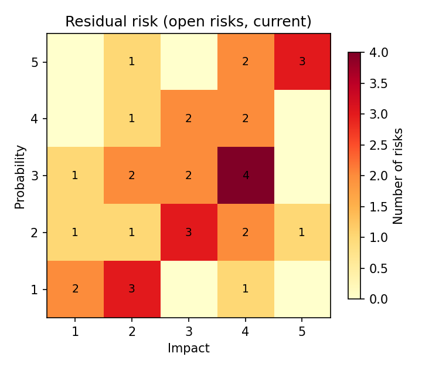
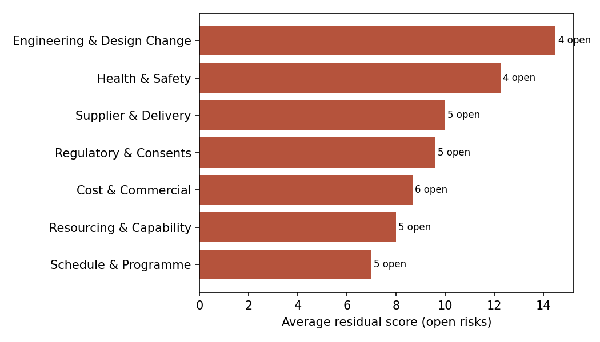
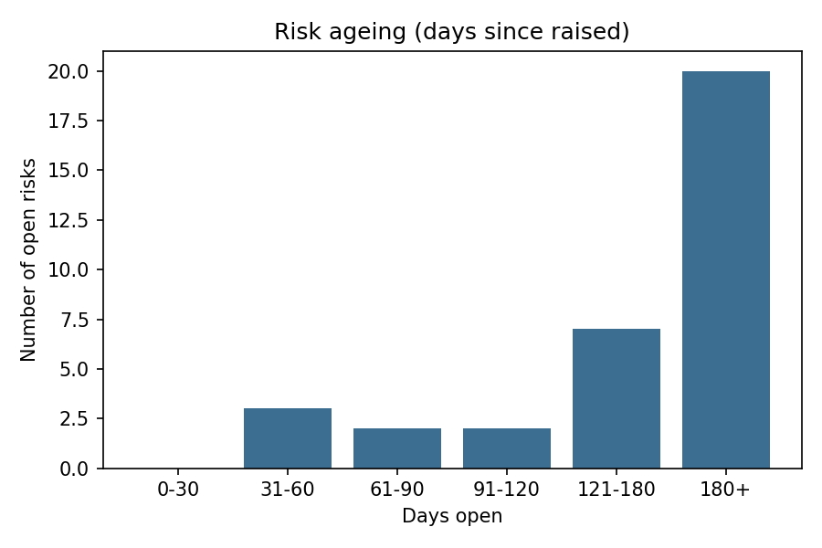
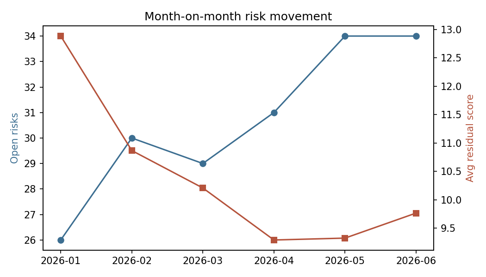

# PMO Risk Register & Dashboard

A fictional programme risk register for a made-up UK infrastructure programme
("Ridgemoor Grid Connection Programme"), built as a case study in the format
most PMO and risk-officer roles actually run on: probability x impact
scoring, inherent vs residual risk, ownership, mitigation actions, ageing,
month-on-month movement and emerging-risk analysis.

**[▶ Open the live interactive dashboard](https://yenlikgaisina.github.io/pmo-risk-register-dashboard/)**

Explore inherent vs residual risk, category filtering, risk ageing, month-on-month movement, emerging risks and overdue mitigation actions directly in the browser.

## Key outcomes

- Built a repeatable analysis/reporting workflow: synthetic data generation, analysis scripts and a static HTML dashboard, each runnable end to end
- Added explicit data-quality checks and validation now covered by an automated pytest suite (unique risk IDs, valid probability/impact ranges, score = probability x impact, referential integrity between risks and mitigation actions, valid dates and status values)
- Produced stakeholder-facing outputs (an interactive dashboard and static charts) rather than analysis only
- Documented limitations, assumptions and production considerations, since the underlying register is synthetic rather than a real organisation's data

## Why I built this

My other portfolio projects (particularly the
[Companies House data delivery & QA pipeline](https://github.com/yenlikgaisina/uk-business-data-delivery-qa)
and the [Trust & Safety risk triage case study](https://github.com/yenlikgaisina/trust-safety-risk-triage-ai-reports))
show data-quality controls and risk classification, but neither of them
uses the specific format a lot of programme/risk-officer roles are built
around: a probability x impact risk register, tracked over time, with
owners, mitigation actions, ageing and month-on-month movement. This
project fills that gap.

## What's in the repository

- `data/risk_register.csv` - 37 risks across 7 categories: static fields
  (title, category, owner, date raised, inherent probability/impact).
- `data/risk_snapshots.csv` - one row per risk per monthly reporting
  cut-off (six months, Jan-Jun 2026): status, residual probability/impact/
  score, days open.
- `data/mitigation_actions.csv` - mitigation actions logged against risks,
  with owners, due dates and status (open / overdue / complete).
- `scripts/generate_data.py` - generates the synthetic register and its
  six-month snapshot history with a fixed random seed.
- `scripts/build_analysis.py` - computes the heatmaps, category summary,
  ageing bands, month-on-month trend, emerging risks, top risks and
  overdue actions; writes `data/dashboard_data.json` and the static charts
  in `assets/`.
- `scripts/build_dashboard.py` - builds `dashboard.html` from that JSON.
- `dashboard.html` - the finished dashboard. Self-contained: no CDN, no
  build step, no server.

Regenerate everything with:

```bash
pip install -r requirements.txt
python scripts/generate_data.py
python scripts/build_analysis.py
python scripts/build_dashboard.py
```

## Approach

Risks are scored on the standard 1-5 x 1-5 scale (score = probability x
impact, so 1-25). Inherent score is fixed at the point a risk is raised;
residual score is reassessed at every monthly cut-off as mitigation
actions land, drift, or get overtaken by events. About 45% of risks trend
down over the six months as their actions close out, 20% are deliberately
"emerging" (getting worse), 20% stay flat, and the rest move both ways
month to month - closer to how a real register behaves than a smooth
downward line ever is.

The seven categories (supplier & delivery, cost & commercial, engineering
& design change, schedule & programme, regulatory & consents, resourcing
& capability, health & safety) are the categories most complex
infrastructure and engineering programmes actually track risk against.

A few choices worth flagging:

- **"Emerging risk"** is defined simply as residual score having gone up
  since the previous reporting month. It's a crude signal compared to a
  proper trend/velocity measure, but it's cheap to compute, easy to
  explain to a non-specialist stakeholder, and catches the risks a static
  end-of-month heatmap would hide.
- **Overdue actions** are evaluated only against the latest reporting
  cut-off, not the full history - the dataset doesn't model an action
  being marked overdue and then closed late, which a real system would
  need to.
- **Risk ageing** is measured in days since the risk was first raised, not
  days since last reviewed. Those are different things in a real
  register and I picked the one that's more informative for spotting
  risks that have been open a long time without resolution.

## What the dashboard shows

KPI tiles (open risks, high-residual risks, overdue actions, emerging
risks, closed risks, average residual score), a 5x5 heatmap you can toggle
between inherent and residual risk and filter by category, a category
breakdown by average residual score, a risk-ageing chart, a month-on-month
movement chart (open-risk count and average residual score), a top-10
table by residual score, an emerging-risks table, and an overdue-actions
table.

| | |
|---|---|
|  |  |
|  |  |

## Data disclosure

Everything in this repository - risk titles, categories, owners (role
titles, not named individuals), dates, scores and mitigation actions - is
synthetic, generated by `scripts/generate_data.py` with a fixed random
seed (42). Ridgemoor is not a real programme and this isn't drawn from any
organisation I've worked with. I designed the scenario to behave the way a
real register tends to (a mix of improving, worsening, flat and volatile
risks; a plausible category and score distribution) but none of the
specifics describe anything real.

## What I'd do differently with a real system

I haven't used Active Risk Manager or an equivalent RMIS, and this project
doesn't try to reproduce one. A real system would need field-level audit
history rather than monthly snapshots, formal approval/sign-off gates on
risk changes, notification-driven escalation rather than a static overdue
flag, and integration with a live actions tracker instead of a CSV. What
this project does demonstrate is the analysis and reporting layer on top
of that: turning a risk register into the KPIs, heatmap, ageing and
movement views a risk or programme meeting actually needs.

## Development note

I used Claude (Anthropic) to help write the synthetic-data generator, the
analysis script and the dashboard's front-end (plain JavaScript and inline
SVG - no chart library). The scenario design, category structure, scoring
approach and choice of what to measure (ageing, movement, emerging risks,
the specific KPIs) are mine; I reviewed the generated code, fixed the
issues I found (an unrealistic ageing distribution, timestamps leaking
into the overdue-actions table) and adjusted it before publishing it here.
